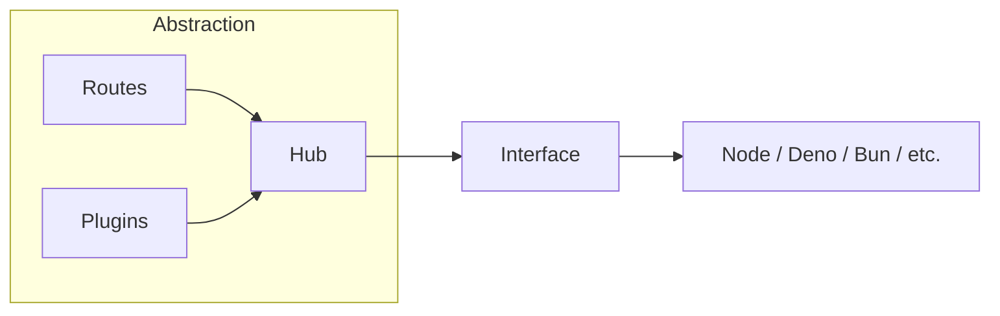

# What is a hub?

The `Hub` is the heart of your application. It centralizes configuration, routes, and plugins. These elements do not depend on the runtime platform. They can live in any JavaScript environment. (Some features are exceptions and still require a server environment because they create files.)



## Create a hub

```ts twoslash
// @version: 0
<!--@include: @/examples/v0/guide/server/createHub/basic.ts-->
```
Simply import the `createHub` function from `@duplojs/http`, call it, configure your environment, register your plugins, and register your routes. 

::: info 
- The `codeGenerator` plugin creates a type definition file for your routes’ input/output.
- Your routes are registered via the `routeStore`. All routes, once declared, are automatically registered in the `routeStore`.
:::

