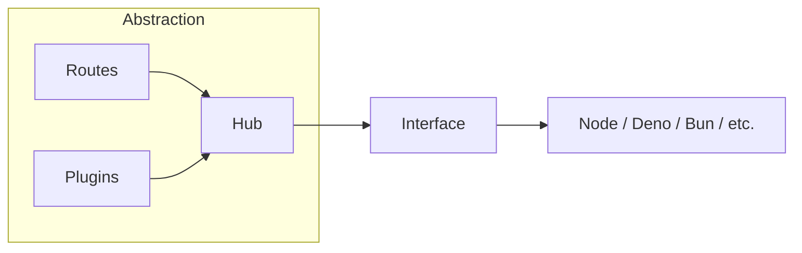

# C'est quoi un hub ?

Le `Hub` est le cœur de votre application. Il centralise la configuration, les routes et les plugins. Ces éléments ne dépendent pas de la plateforme d'exécution. Ils peuvent vivre dans n'importe quel environnement JavaScript. (Certaines fonctionnalités font exception et nécessitent quand même d'être sur un environnement serveur car elles créent des fichiers.).



## Créer un hub

```ts twoslash
// @version: 0
<!--@include: @/examples/v0/guide/server/createHub/basic.ts-->
```
Il vous suffit d'importer la fonction `createHub` de `@duplojs/http`, de l'appeler, de configurer votre environnement, d'enregistrer vos plugins et d'enregistrer vos routes. 

::: info 
- Le plugin `codeGenerator` permet de créer un fichier de typage des entrées-sorties de vos routes.
- Vos routes sont enregistrées depuis le `routeStore`. Toutes vos routes, lorsqu'elles sont déclarées, sont automatiquement enregistrées dans le `routeStore`.
:::


